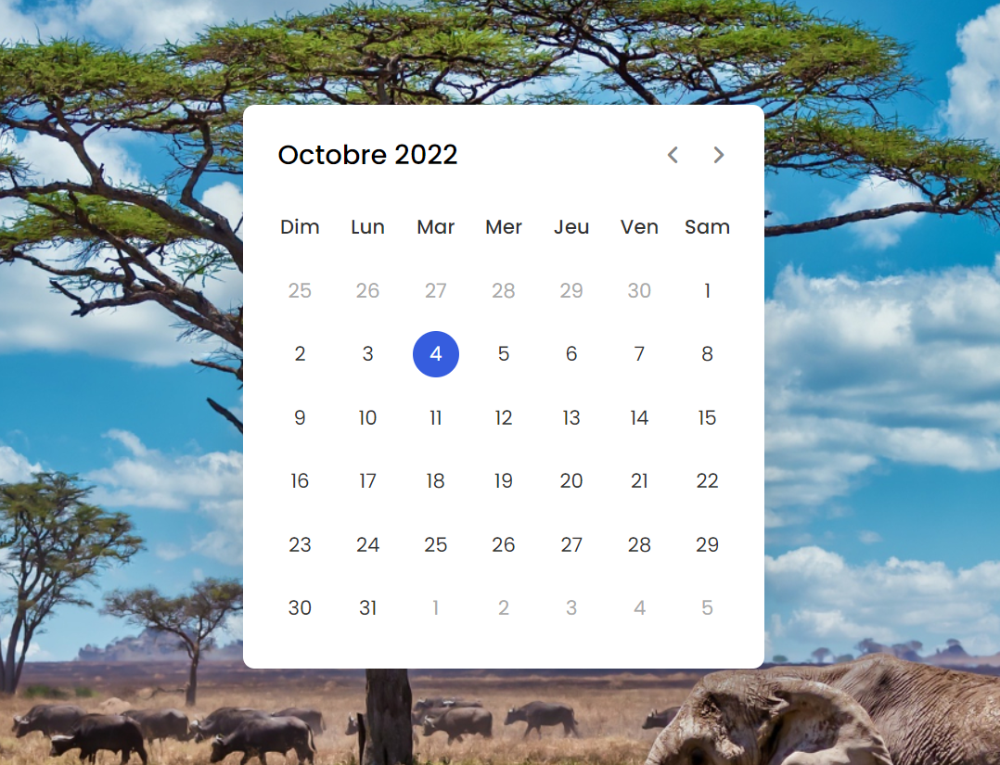

## Projet 2 
### Développement d'un calendrier dynamique (js_calendar branch)

<a href="https://github.com/alban-okoby/jschallenge/tree/js_calendar"> Projet 2 </a>

### technologies impliquées 
<ul>
    <li> html </li>
    <li> css</li>
    <li> JS</li>
</ul>

#### Features du calendrier 
<ul>
    <li>Désigne la date du jour </li>
    <li>Actualisation automatique de la date</li>
    <li>Permet de voir les prochain mois  </li>
    <li>Permet de voir les prochain années  </li>
</ul>

##### Aperçu 

     

## Projet 1 
### Développement d'une calculatrice avec les fonctionnalités de bases
<a href="https://github.com/alban-okoby/jschallenge/tree/main"> Projet 1 </a>
### Parties terminées 
<ul>
    <li> Squellete (html) </li>
    <li> Design (css)</li>
</ul>

#### En developpement..
###### Foncionnalites de calculs avec ( JavaScript )
<ul>
    <li>Addition </li>
    <li>Soustraction </li>
    <li>Multiplication </li>
    <li>Division</li>
    <li> Modulo </li>
</ul>

##### Aperçu 

     
    
    
    
    

     
    
    
    

#### Ne pas hesiter à forker, lâcher une étoile et/ou telecharger le projet.
