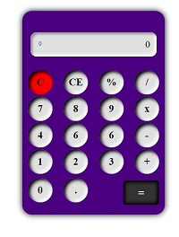
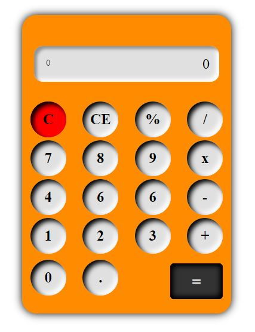
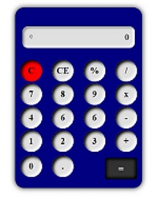
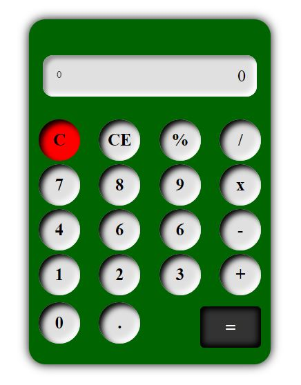
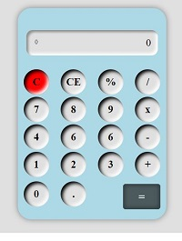
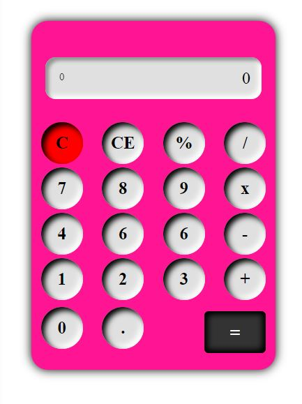

### Développement d'une calculatrice avec les fonctionnalités de bases

### Parties terminées 
<ul>
    <li> Squellete (html) </li>
    <li> Design (css)</li>
</ul>

#### En developpement..
###### Foncionnalites de calculs avec ( JavaScript )
<ul>
    <li>Addition </li>
    <li>Soustraction </li>
    <li>Multiplication </li>
    <li>Division</li>
    <li> Modulo </li>
</ul>

##### Aperçu 

     
    
    
    
    

     
    
    
    

#### Ne pas hesiter à forker, lâcher une étoile et/ou telecharger le projet.
