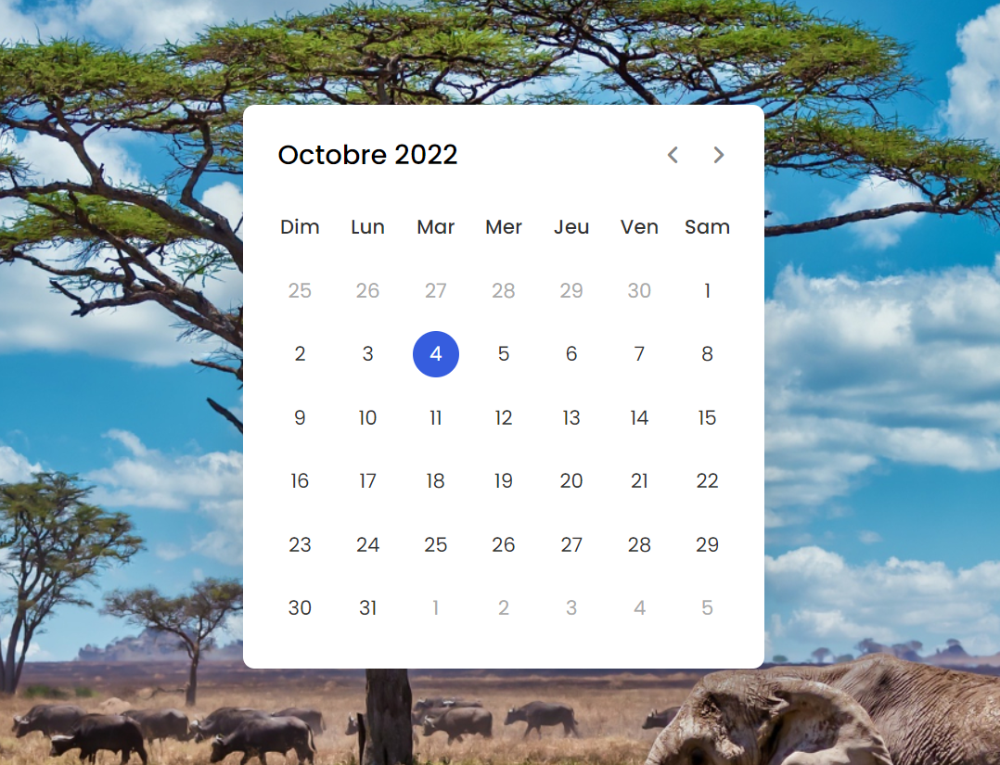

### PROJET 2 (js_calendar branch): Développement d'un calendrier dynamique

### technologies impliquées 
<ul>
    <li> html </li>
    <li> css</li>
    <li> JS</li>
</ul>

###### Features du calendrier 
<ul>
    <li>Désigne la date du jour </li>
    <li>Actualisation automatique de la date</li>
    <li>Permet de voir les prochain mois  </li>
    <li>Permet de voir les prochain années  </li>
</ul>

##### Aperçu 

     

